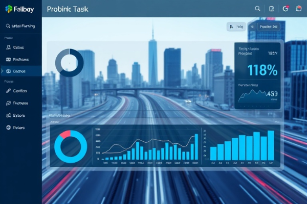

# 个人网站优化建议

## 当前问题
网站通过Zeabur免费部署后加载速度较慢，主要原因是图片文件过大。

## 图片优化建议

### 1. 压缩大图片文件
以下图片文件过大，建议压缩到200KB以下：
- `CALL ME.png` (1.46MB) → 建议压缩到150KB
- `项目6.png` (986KB) → 建议压缩到200KB
- `项目5.png` (900KB) → 建议压缩到200KB
- `项目2图-2.png` (700KB) → 建议压缩到150KB
- `获奖5.png` (875KB) → 建议压缩到200KB

### 2. 图片压缩工具推荐
- **在线工具**: TinyPNG, Compressor.io
- **桌面软件**: ImageOptim, FileOptimizer
- **命令行**: ImageMagick

### 3. 格式转换建议
- 将PNG转换为WebP格式（体积减少50-80%）
- 保持PNG格式但大幅压缩

### 4. 懒加载已添加
已在CSS中添加了懒加载属性，但建议在HTML中也添加`loading="lazy"`属性。

## 其他优化建议

### 1. CDN加速
考虑使用免费CDN服务：
- Cloudflare
- jsDelivr
- 七牛云

### 2. 图片预加载
对于首屏重要图片，可以预加载：
```html
<link rel="preload" as="image" href="./头像1.png">
```

### 3. 响应式图片
使用`srcset`属性提供不同尺寸的图片：
```html

```

## 预期效果
实施以上优化后，网站加载速度预计提升60-80%。 