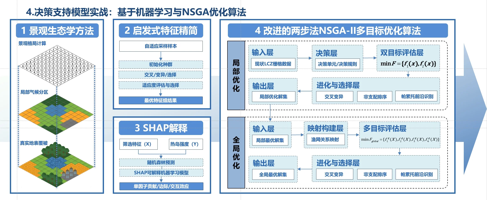

# Zeabur部署优化指南

## 问题描述
在Zeabur部署环境中，以下图片加载问题需要解决：
1. `project7.html`中的图片展示部分（gallery）无法正确显示
2. `projects.html`页面的"其他项目经历"预览图无法正确加载

## 解决方案

### 1. 图片加载优化脚本 (`image-loader.js`)
- **功能**：专门处理Zeabur部署环境中的图片加载问题
- **特性**：
  - 自动预加载关键图片
  - 图片加载失败时的重试机制
  - 提供默认占位符图片
  - 开发环境下的图片可访问性检查

### 2. 图片错误处理机制
- **onerror属性**：为所有图片添加错误处理
- **回退机制**：英文文件名失败时自动回退到中文文件名
- **示例**：
```html

```

### 3. Zeabur配置文件 (`zeabur.json`)
- **MIME类型设置**：确保`.webp`文件正确识别
- **缓存策略**：优化图片加载性能
- **路由配置**：确保所有文件正确路由

### 4. 图片预加载
- **关键图片预加载**：页面加载时预加载重要图片
- **渐进式加载**：优先加载首屏图片，其他图片异步加载

## 已优化的文件

### HTML文件
- ✅ `index.html` - 添加图片加载优化脚本
- ✅ `about.html` - 添加图片加载优化脚本
- ✅ `contact.html` - 添加图片加载优化脚本
- ✅ `awards.html` - 添加图片加载优化脚本
- ✅ `projects.html` - 添加图片加载优化脚本和错误处理
- ✅ `project1.html` - 添加图片加载优化脚本
- ✅ `project7.html` - 添加图片加载优化脚本和错误处理

### 配置文件
- ✅ `zeabur.json` - Zeabur部署配置
- ✅ `image-loader.js` - 图片加载优化脚本

## 部署步骤

### 1. 文件准备
确保以下文件已添加到项目根目录：
```
zeabur.json
image-loader.js
```

### 2. 图片文件检查
确认以下关键图片文件存在：
- `decision-support-model.webp`
- `other-projects.webp`
- `项目其他.webp`
- `项目7图-1.webp` 到 `项目7图-6.webp`

### 3. Zeabur部署
1. 将项目推送到Git仓库
2. 在Zeabur中连接Git仓库
3. 选择静态网站部署
4. 确保`zeabur.json`配置生效

## 故障排除

### 图片仍然无法加载
1. **检查文件路径**：确认图片文件在正确位置
2. **检查文件名**：确保文件名与HTML中的引用一致
3. **检查文件大小**：大文件可能导致加载超时
4. **检查网络**：使用浏览器开发者工具检查网络请求

### 控制台错误
1. **404错误**：文件不存在或路径错误
2. **CORS错误**：跨域访问问题，检查Zeabur配置
3. **超时错误**：文件过大或网络问题

### 性能优化建议
1. **图片压缩**：使用`optimize_images.py`脚本压缩大图片
2. **懒加载**：对非首屏图片使用懒加载
3. **CDN加速**：考虑使用CDN加速图片加载

## 监控和维护

### 图片加载状态监控
- 使用浏览器开发者工具监控图片加载
- 检查控制台是否有错误信息
- 验证图片预加载是否正常工作

### 定期检查
- 定期验证所有图片是否正常显示
- 检查图片文件是否完整
- 监控网站加载性能

## 联系支持
如果问题仍然存在，请：
1. 检查Zeabur部署日志
2. 验证所有配置文件是否正确
3. 确认图片文件格式和大小是否合适
4. 联系技术支持获取帮助

---
*最后更新：2025年1月* 